<div align="center">


</div>

<br>

## ⚙️ // SOBRE_MIM.log

```yaml
class Desenvolvedor:
    nome: "Miguel Bertolon"
    formacao_tecnica: "Desenvolvimento de Sistemas — ETEC Prof. José Ignácio Azevedo Filho (Centro Paula Souza)"
    formacao_atual: "Ciência da Computação — UNIFRAN"
    modulos_instalados: ["HTML", "CSS", "JavaScript", "MySQL Server", "Python"]
    em_pesquisa: ["Banco de Dados", "AWS", "Segurança Cibernética", "Inteligência Artificial"]
    diretiva_principal: "Banco de Dados & Segurança Cibernética"
    status: "🟢 online — compilando conhecimento"
```

Movido a engrenagens do passado e circuitos do futuro — sou apaixonado por construir sistemas sólidos hoje enquanto me aprofundo nas tecnologias que vão blindar e sustentar o amanhã.

<br>

## 🛠️ // ARSENAL_TÉCNICO

<div align="center">


</div>

<br>

## 🔐 // MÓDULOS_EM_EXPANSÃO

<table align="center">
<tr>
<td align="center" width="200">
🗄️<br><b>Banco de Dados</b><br><sub>Modelagem, SQL, otimização</sub>
</td>
<td align="center" width="200">
🛡️<br><b>Segurança Cibernética</b><br><sub>Defesa de sistemas e redes</sub>
</td>
<td align="center" width="200">
☁️<br><b>AWS</b><br><sub>Cloud computing</sub>
</td>
<td align="center" width="200">
🤖<br><b>Inteligência Artificial</b><br><sub>Integração e fundamentos de IA</sub>
</td>
</tr>
</table>

<br>

## 📊 // TELEMETRIA_DO_TERMINAL

<div align="center">





</div>

<br>

## 🔗 // CANAIS_DE_CONEXÃO

<div align="center">

<a href="https://www.linkedin.com/in/miguelbertolon/"></a>
<a href="mailto:bertolonmiguel@hotmail.com"></a>
<a href="https://github.com/MiguelBertolon"></a>

</div>

<br>

<div align="center">


<sub>⚙️ Forjado entre engrenagens antigas e circuitos neon ⚡</sub>

</div>
